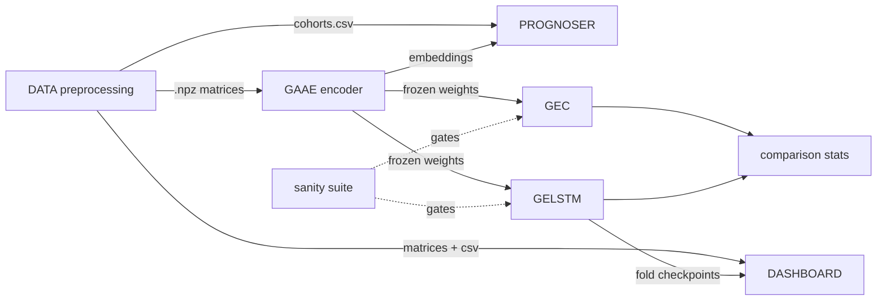

# AD Early Detection — Codebase Knowledge Document

> **Purpose.** A self-contained "brain dump" of this repository so that an engineer or LLM with
> *no prior access* can implement features, fix bugs, and refactor safely. Every claim is tied to a
> real file path (relative to the repo root). Diagrams live in [`assets/`](assets/).
>
> **Audience.** Contributors to the research codebase; thesis work on Alzheimer's early detection.
>
> **How to read this.** Part 1 = high-level overview. Part 2 = system architecture. Part 3 =
> feature-by-feature. Part 4 = gotchas ("things you must know before changing code"). Part 5 =
> technical reference & glossary. Part 6 = assumptions / open questions.

---

## Table of Contents

1. [High-Level Overview](#part-1--high-level-overview)
2. [System Architecture](#part-2--system-architecture)
3. [Feature-by-Feature Analysis](#part-3--feature-by-feature-analysis)
4. [Nuances, Subtleties & Gotchas](#part-4--nuances-subtleties--gotchas)
5. [Technical Reference & Glossary](#part-5--technical-reference--glossary)
6. [Assumptions, Open Questions & Next Steps](#part-6--assumptions-open-questions--next-steps)

---

# Part 1 — High-Level Overview

## 1.1 What this project is

A **research codebase for early detection of Alzheimer's disease (AD)** from **longitudinal
resting-state fMRI** in the **DELCODE** cohort. The central scientific task is to predict whether a
subject with **Mild Cognitive Impairment (MCI)** will **convert to AD**, and *when*.

The modeling idea: each fMRI scan yields a **functional-connectivity (FC) matrix** (region-to-region
Pearson correlations over an atlas). FC matrices are treated as **brain graphs** and embedded with a
**Graph Attention Autoencoder (GAAE)**. Those embeddings feed two downstream tasks:

- **Classification** (`CLASSIFIER/`) — will this subject convert? (binary)
- **Prognosis / survival** (`PROGNOSER/`) — time-to-conversion modeling (Cox, RSF, LSTM-Surv, KM).

A **dashboard** (`DASHBOARD/`) lets researchers browse cohorts, inspect per-subject trajectories,
and run GELSTM inference interactively.

## 1.2 The four active subsystems

| Subsystem | Path | Role |
|---|---|---|
| **Preprocessing** | `DATA/src/processing/` | Raw BOLD → atlas extraction → FC matrices (`.npz`). |
| **Classifier** | `CLASSIFIER/` | GAAE encoder + GEC (static) + GELSTM (longitudinal) classifiers. The reproducibility framework lives here. |
| **Prognoser** | `PROGNOSER/` | Survival analysis consuming GAAE embeddings. |
| **Dashboard** | `DASHBOARD/` | FastAPI backend + Vite frontend for cohort browsing & GELSTM inference. |

**Legacy / read-only** (do not pattern-match against these when writing new code):
`__CLASSIFIER__/` (prior iteration), `ABI/` (artifact-based indices, from an older TMS project),
`DCI/` (disconnectivity index). Source: [`.claude/CLAUDE.md`](../.claude/CLAUDE.md),
[`.claude/rules/architecture.md`](../.claude/rules/architecture.md).

## 1.3 Tech stack

- **Python 3.10.12**, shared **project-root `.venv`** used by CLASSIFIER, PROGNOSER, and the
  DASHBOARD model-inference path.
- **torch 2.10.0+cu128**, **torch_geometric 2.7.0** (GATv2 graph layers), numpy 1.26.4,
  pandas 2.2.0, scikit-learn 1.7.2. Source: [`.claude/rules/environment.md`](../.claude/rules/environment.md).
- **PROGNOSER** adds lifelines, scikit-survival, joblib (`PROGNOSER/requirements.txt`); optionally
  pycox for DeepSurv.
- **DASHBOARD** backend adds fastapi, uvicorn, networkx, umap-learn, nibabel, scipy, lifelines,
  nilearn (`DASHBOARD/requirements.txt`); frontend is **Vite** + Chart.js + NiiVue.
- Use latest APIs as of **May 2026**; e.g. `torch.compile`, not the deprecated `torch.jit.script`.

## 1.4 End-to-end data flow (one picture)

See [`assets/system-architecture.md`](assets/system-architecture.md) for the full diagrams. Summary:

```
Raw rs-fMRI BOLD  ──preprocess──▶  FC matrices (.npz, per visit)
                                        │
                            ClassificationDataset → PyG graphs
                                        │
                              GAAE encoder (pretrained, frozen)
                          ┌─────────────┼───────────────┐
                  GEC (static)   GELSTM (longitudinal)   PROGNOSER (survival)
                          └─────────────┼───────────────┘
                            metrics + statistical comparison
                                        │
                                  DASHBOARD (viz + inference)
```

## 1.5 Main features and their business purpose

| Feature | Business need it serves |
|---|---|
| **GAAE pretraining** | Learn a compact, reusable representation of brain connectivity so downstream models train on small clinical cohorts without overfitting. |
| **GEC static classifier** | A simple per-scan conversion classifier; a supervised floor and an ablation point. |
| **GELSTM longitudinal classifier** | The primary model — uses the *trajectory* of connectivity across visits (with inter-visit time) to predict conversion earlier and more accurately. |
| **FDR dimension filtering** | Test whether a discriminative subset of latent dims suffices — interpretability + robustness. |
| **Cross-region comparison** | Decide *which brain networks* (DMN, hippocampus, limbic, DAN, combinations) carry the predictive signal, with proper paired statistics. |
| **PROGNOSER survival** | Move from "will they convert" to "how long until conversion" — clinically richer. |
| **Sanity suite** | Guarantee no data leakage and that models beat trivial baselines before any result is trusted. |
| **Dashboard** | Make cohorts and per-subject trajectories explorable, and serve GELSTM risk predictions to non-coders. |

---

# Part 2 — System Architecture

## 2.1 Component map

See [`assets/system-architecture.md`](assets/system-architecture.md) §1–§2.

- **DATA** produces `.npz` FC matrices + `cohorts.csv` metadata.
- **CLASSIFIER** consumes matrices, trains GAAE → GEC/GELSTM, emits checkpoints + result JSONs.
- **PROGNOSER** consumes `cohorts.csv` + cached GAAE embeddings, fits survival models.
- **DASHBOARD** consumes matrices, `cohorts.csv`, and GELSTM fold checkpoints; serves a SPA.

## 2.2 Layered architecture (enforced in CLASSIFIER, recommended elsewhere)

Source: [`.claude/rules/architecture.md`](../.claude/rules/architecture.md). See diagram §3 in
[`assets/system-architecture.md`](assets/system-architecture.md).

- `CLASSIFIER/model/**` — **pure logic**. No I/O, no `wandb.init`, no path construction, no
  hardcoded hyperparameters. Need a hyperparameter? Add a field to a `configs/` dataclass.
- `CLASSIFIER/configs/**` — `@dataclass` hyperparameter bundles with typed defaults +
  `__post_init__` validation.
- `CLASSIFIER/notebooks/**` — **orchestration only**: seed, load config, build splits, call into
  `model/`, save results + checkpoint. *No training loops or metric implementations in notebooks.*
- `CLASSIFIER/common/**` — shared utilities with no model-specific imports.

## 2.3 Cross-cutting concerns

These are *contracts*, enforced by rules in `.claude/rules/` and by tests in `CLASSIFIER/tests/`.

### Seeding & reproducibility — [`.claude/rules/seeding.md`](../.claude/rules/seeding.md)
Every notebook seeds via `CLASSIFIER/common/seeding.py`:
```python
from CLASSIFIER.common.seeding import set_seed, make_rng, make_torch_generator, seed_worker
SEED = 42
set_seed(SEED)                 # python random, numpy global, torch CPU+CUDA, cudnn deterministic
rng = make_rng(SEED)           # numpy Generator (PCG64) — pass EXPLICITLY to anything that shuffles
g = make_torch_generator(SEED) # torch.Generator for DataLoader
DataLoader(ds, shuffle=True, generator=g, worker_init_fn=seed_worker)
```
**Never** call `np.random.seed` or `torch.manual_seed` directly in new code.

### Splits & hygiene
`CLASSIFIER/common/splits.py::make_splits(subject_ids, labels, seed, ...)` returns
subject-disjoint train/val/test. `CLASSIFIER/common/sanity.py::run_full_audit(...)` hard-fails if a
subject leaks across splits — this is the `SANITY_SPLIT_HYGIENE` gate.

### Threshold leakage — [`.claude/rules/evaluation.md`](../.claude/rules/evaluation.md)
- The operating threshold is computed on the **validation** set (`youden`, `best_f1`, or `fixed`),
  stored in the checkpoint as `best_threshold`, and reused at test time.
- `evaluate` / `evaluate_classifier` **require an explicit threshold and raise if it is `None`** —
  they never derive a threshold from the data they are scoring.

### Full-state checkpoints — [`.claude/rules/checkpoints.md`](../.claude/rules/checkpoints.md)
Saved via `CLASSIFIER/common/provenance.py::save_full_checkpoint`. Schema:
```python
{
  "model_state_dict", "optimizer_state_dict", "scheduler_state_dict",  # or None
  "epoch", "val_auc", "best_threshold",        # best_threshold is validation-derived
  "rng_state", "torch_rng_state",              # to resume the same RNG stream
  "config", "eval_config",                      # asdict(...) — run reproducible from artifact
}
```
Loaders must tolerate legacy weights-only files: `ckpt.get("model_state_dict", ckpt)`. Save the
**best** checkpoint by val AUC, not the last.

### Fail loudly — [`.claude/rules/errors.md`](../.claude/rules/errors.md)
Prefer raising `ValueError` with a descriptive message over silent fallbacks. Guard clauses at
function entry. Canonical example: `evaluate_classifier` raising when `threshold is None`.

### Shared artifact contract
The **GAAE encoder is pretrained once** and consumed (frozen) by GEC, GELSTM, PROGNOSER embeddings,
and DASHBOARD inference. Encoder dims in downstream configs (`gaae_latent=64`) must match the
pretrained encoder. Transfer helper: `CLASSIFIER/common/utils.py::load_frozen_encoder_from_gaae`.

---

# Part 3 — Feature-by-Feature Analysis

For each feature: **purpose → mechanism → interactions → gotchas**.

## 3.1 GAAE — Graph Attention Autoencoder

- **Purpose.** Unsupervised representation learning on FC graphs so downstream classifiers work on
  small clinical samples.
- **Mechanism.** 3-layer **GATv2** encoder + **FiLM** conditioning on demographics (age, sex), with
  a feature decoder and an `InnerProductDecoder` for adjacency reconstruction. Files:
  `CLASSIFIER/model/GAAE/models.py`, `train.py`, `losses.py`.
- **Interactions.** Produces `gaae_encoder.pth` consumed everywhere downstream (registry id
  `gaae_pretrain_whole_brain`).
- **Gotcha.** **Intentionally un-refactored**: `CLASSIFIER/model/GAAE/train.py` still has hardcoded
  `wandb.init` and loose kwargs (it trains once, not per experiment). *Do not copy this pattern.*
  Use `model/GEC/train.py` / `model/GELSTM/train.py` as the reference for new training code.
  Source: [`.claude/rules/architecture.md`](../.claude/rules/architecture.md).

## 3.2 GEC — Graph Encoder Classifier (static / flattened)

- **Purpose.** Per-scan (or flattened-trajectory) binary conversion classifier; a supervised
  baseline and ablation against GELSTM.
- **Mechanism.** GAAE encoder → `global_mean_pool` → MLP head → logit. Class imbalance handled with
  a `pos_weight`. Files: `CLASSIFIER/model/GEC/models.py`, `train.py`
  (`train_classifier`, `evaluate_classifier`).
- **Batch contract.** Documented by `GECBatch` in `CLASSIFIER/configs/gec.py`: a PyG `Batch` must
  expose `x`, `edge_index`, `batch`, `is_converter`, `patient_age`, `patient_sex`.
- **Interactions.** Registry ids `gec_trajectory_whole_brain`, `logreg_static_whole_brain` (LogReg
  is a separate sklearn baseline on GAAE embeddings).

## 3.3 GELSTM — Graph Encoder + LSTM (longitudinal) — *primary model*

- **Purpose.** Use the *trajectory* of connectivity across visits for earlier/more accurate
  conversion prediction.
- **Mechanism.** Encode each visit with the GAAE encoder; build a sequence of
  `[z_t ‖ Δt_t]` (latent concatenated with normalized inter-visit time delta); run an LSTM
  (hidden=128, layers=2); MLP head → logit. Files: `CLASSIFIER/model/GELSTM/models.py`, `train.py`
  (`train_model`, `evaluate`), plus sequence batching utilities.
- **Interactions.** Registry id `gelstm_trajectory_whole_brain`. Fold checkpoints
  (`best_model_fold*.pth`) are consumed by the DASHBOARD ensemble service.
- **Gotchas.** Time-delta handling (`use_time_delta`, `zero_time_delta`) and visit-order shuffling
  (`shuffle_order`) are ablation switches in `EvalConfig` — the `SANITY_LONGITUDINAL_GELSTM`
  notebook flips them to prove the model actually uses temporal structure.

See [`assets/classifier-models.md`](assets/classifier-models.md) for the lineage + training
sequence diagrams.

## 3.4 FDR latent-dimension filtering

- **Purpose.** Test whether a discriminative subset of GAAE dims preserves/improves performance.
- **Mechanism.** Per-fold FDR scoring in `CLASSIFIER/common/fdr.py`; selected dims passed via
  `EvalConfig.dim_filter`. Registry id `gelstm_fdr_filtered_whole_brain` (`fdr_top_k: 32`).
- **Gotcha.** FDR scores must be computed **per fold on training data only** (no leakage).

## 3.5 Cross-region comparison

- **Purpose.** Decide which brain networks carry signal, with statistically sound paired tests on a
  *shared* test set.
- **Mechanism.** `CLASSIFIER/common/comparison.py` (paired DeLong test, paired bootstrap CI,
  Holm–Bonferroni, McNemar) + `CLASSIFIER/common/contrasts.py` (pre-registered H1/H2/H3 region
  contrasts). Registry id `comparison_cross_region` aggregates regions
  `[whole_brain, dmn, hippocampus, limbic, dan, dmn_hippo, dmn_limbic, dmn_limbic_hippo, all]`.
- **Gotcha.** Use *paired* tests because the same subjects appear across region models — independent
  t-tests would be wrong.

## 3.6 Sanity suite

- **Purpose.** Gate trust before any result is believed.
- **Mechanism.** Three notebooks: `SANITY_SPLIT_HYGIENE` (hard-fail on subject leakage),
  `SANITY_BASELINE_METADATA_TIME` (metadata-only floor: age, sex, visit timing — any FC model must
  beat it), `SANITY_LONGITUDINAL_GELSTM` (shuffle-order / zero-Δt ablations).

## 3.7 PROGNOSER — survival analysis

- **Purpose.** Time-to-conversion (MCI→AD) prediction; clinically richer than binary classification.
- **Mechanism.** `PROGNOSER/common/survival_table.py::build_survival_table` constructs `(T, E,
  covariates)` over a **symmetric at-risk window** (converter window ends at first AD visit;
  non-converter window ends at last MCI visit — censored). Features are assembled by **embedding
  strategy** (`baseline`, `last`, `mean`, `slope`, `all_aggs`, `sequence`). Models in
  `PROGNOSER/model/` share a `SurvivalModel` ABC (`base.py`): `kaplan_meier.py`, `cox.py`,
  `cox_time_varying.py`, `rsf.py`, `lstm_surv.py`, `deepsurv.py` (optional). Metrics
  (C-index, IBS, time-dependent AUC) in `PROGNOSER/common/metrics.py`.
- **Interactions.** Consumes GAAE embeddings precomputed/cached by
  `PROGNOSER/src/build_subject_embeddings.py` (its predecessor `build_baseline_embeddings.py` is
  deprecated). The embedding strategy keys are exactly `baseline | last | mean | slope | all_aggs |
  sequence` (verified: `EmbeddingStrategy` Literal in `PROGNOSER/common/embeddings.py`; `all_aggs`
  = concat of `[baseline, last, mean, slope]` → 4×latent_dim, `sequence` is the ordered series for
  LSTM-Surv). Notebooks (verified present under `PROGNOSER/notebooks/`):
  `PROGNOSER_RUNNER.ipynb` (main sweep), `KAPLAN_MEIER_BASELINE.ipynb`,
  `CROSS_NETWORK_COMPARISON.ipynb`. Survival-table API:
  `build_survival_table(...)`, `filter_to_split(table, splits_dir, split)`, `make_xte(...)`.
- **Gotcha.** **Look-ahead leakage**: *all* longitudinal features must be computed strictly inside
  the at-risk window. This is the whole reason the window is symmetric. See
  [`assets/prognoser-survival.md`](assets/prognoser-survival.md).

## 3.8 DATA preprocessing pipeline

- **Purpose.** Turn raw rs-fMRI into atlas-based FC matrices and network subsets.
- **Mechanism.** `DATA/src/processing/` — Schaefer-200 whole-brain extraction, Tian subcortex
  (hippocampus), combined Schaefer+Tian, and network-subset extraction; orchestrated by a run-all
  script. Output: `.npz` correlation matrices (Fisher z-transformed) under versioned dirs.
- **Data versions.** `__v3__` = whole-brain Schaefer-200 (baseline for everything); `__v4__`–`__v11__`
  = network subsets/combinations (DMN, hippocampus, limbic, DAN, and combinations). Metadata:
  `DATA/DELCODE/__v3__/metadata/cohorts.csv`; canonical split CSVs (single source of truth, via
  `DATA/src/splitting/load_splits.py::splits_dir`) live under `DATA/DELCODE/SPLITS/pretrain` (all
  cohorts, 241/115/116 — used only to pretrain the GAAE encoder) and `DATA/DELCODE/SPLITS/downstream`
  (mci/converter only, 99/34/34 — used by every model built on the frozen GAAE encoder: GEC, GELSTM,
  Long-GEC-MLP, LogReg, PROGNOSER).
  *(Exact per-version ROI counts come from secondary reading — verify in the processing scripts
  before depending on them.)*

## 3.9 DASHBOARD

- **Purpose.** Interactive cohort/patient exploration + GELSTM inference for non-coders.
- **Backend.** FastAPI app `DASHBOARD/app/main.py` registers routers from `app/routes/` and runs a
  lifespan that arms a job watchdog. Business logic in `app/services/` and `app/cohort_stats.py`.
- **Three views** (frontend `DASHBOARD/frontend/`): **Population**, **Cohort**, **Patient**.
- **Precompute.** Expensive cohort analytics (UMAP manifold, biomarkers, EBM staging, brain-age,
  graph topology, GELSTM predictions, dynamic FC) are computed by a **detached subprocess**
  (`app/precompute.py`) managed by `app/services/job_manager.py`, with a watchdog that kills runaway
  or stalled jobs.
- **GELSTM inference.** `app/services/gelstm.py` lazily loads the 5 fold checkpoints +
  `gaae_encoder.pth`, computes a `model_version = SHA1(checkpoints)`, caches per-subject predictions,
  and returns mean ± CI over folds. **Reuses the project-root `.venv`** for torch/PyG/nilearn.

See [`assets/dashboard-architecture.md`](assets/dashboard-architecture.md) for topology, job
lifecycle, and inference diagrams.

## 3.10 Cross-feature interaction map



---

# Part 4 — Nuances, Subtleties & Gotchas

> **Things you must know before changing code.**

1. **GAAE is deliberately un-refactored.** Hardcoded `wandb.init` + loose kwargs in
   `CLASSIFIER/model/GAAE/train.py` are *intentional* (trains once). Don't "fix" it by copying its
   style into new code; use GEC/GELSTM `train.py` as the template.

2. **Threshold must be explicit and validation-derived.** `evaluate`/`evaluate_classifier` raise on
   `threshold=None`. Picking a threshold from the data you're scoring is leakage. The
   validation-derived `best_threshold` is persisted in the checkpoint.

3. **Explicit RNG threading everywhere.** Pass `rng` (from `make_rng`) into anything that shuffles
   and `generator=g` + `worker_init_fn=seed_worker` into every `DataLoader`. No bare
   `np.random.seed` / `torch.manual_seed` in new code.

4. **Subject-disjoint splits are non-negotiable.** A subject has multiple visits; leaking any visit
   across train/val/test leaks the subject. `SANITY_SPLIT_HYGIENE` exists to catch this — run it.

5. **PROGNOSER at-risk window prevents look-ahead.** Compute features only within
   `[baseline, window_end)`. Adding a feature that peeks past `window_end` silently invalidates the
   survival results.

6. **DASHBOARD must use the project-root `.venv`**, not a `DASHBOARD/.venv`. The model-inference path
   imports torch/torch_geometric/nilearn from the shared root venv. The DASHBOARD
   `requirements.txt` deliberately does **not** pin torch/PyG.

7. **GELSTM service caches by checkpoint hash.** `model_version = SHA1(checkpoints)`; replacing fold
   checkpoints auto-invalidates cached predictions. If you change checkpoint contents, expect a
   recompute.

8. **Precompute jobs are detached and watchdogged.** Long jobs run as separate processes; the
   watchdog kills them past `MAX_JOB_AGE_S` (30 min) or after `STALL_THRESHOLD_S` (5 min) without a
   status update. Don't assume a job runs unbounded.

9. **Config validation lives in `__post_init__`.** Invalid combos raise `ValueError` (e.g.
   `threshold_mode='fixed'` requires `fixed_threshold`). Add new knobs as dataclass fields — don't
   thread new kwargs through functions.

10. **Legacy dirs are read-only.** `__CLASSIFIER__/`, `ABI/`, `DCI/` — kept only for back-compat /
    history. Don't import from them or mirror their patterns. (Note: the git status at session start
    shows many files under `__CLASSIFIER__/` staged for deletion — a consolidation to a single
    classifier dir appears to be in progress.)

11. **Root `README.md` is stale.** It still describes the old layout (e.g. `/DCI: source code for
    ABI`, a top-level `MODEL_COMPARISON_*.ipynb`) and predates the active/legacy split. Trust
    `.claude/CLAUDE.md` + `.claude/rules/` and this document over the root README.

---

# Part 5 — Technical Reference & Glossary

## 5.1 Experiment registry (`CLASSIFIER/experiments.yaml`)

The single source of truth for "what experiments exist." **12 entries** (verified against the
file). Each entry has fields `id` (kebab-case slug), `mode`, `model`, `dataset`, `seed` (all 42),
`notebook` (relative to `CLASSIFIER/notebooks/`), optional `checkpoint_path`, and `notes`.

| id | mode | model | notebook | notes |
|---|---|---|---|---|
| `gelstm-trajectory-whole-brain` | longitudinal | GELSTM | `LONGITUDINAL/LONGITUDINAL_GELSTM_DELCODE.ipynb` | Full-trajectory GELSTM on GAAE latents (primary model). |
| `gelstm-trajectory-fdr` | longitudinal | GELSTM | `LONGITUDINAL/LONGITUDINAL_GELSTM_FDR_FILTERED_DELCODE.ipynb` | Per-fold FDR latent-dim selection. |
| `gelstm-early-detection-first-n` | longitudinal | GELSTM | `LONGITUDINAL/LONGITUDINAL_GELSTM_FIRST_N_DELCODE.ipynb` | First-N-visits ablation (early detection). |
| `gec-trajectory` | longitudinal | GEC | `LONGITUDINAL/LONGITUDINAL_GEC_DELCODE.ipynb` | Flattened-trajectory GEC over FDR-selected GAAE dims + Δt. |
| `gaae-static` | static | GAAE | `STATIC/STATIC_GAAE_DELCODE_WHOLE_BRAIN.ipynb` | Per-scan GAAE embedding with subject rollup. |
| `logreg-static` | static | LogReg | `STATIC/STATIC_LOGREG_DELCODE_WHOLE_BRAIN.ipynb` | Per-scan logistic-regression baseline. |
| `model-comparison` | baseline | multi | `BASELINE/BASELINE_MODEL_COMPARISON_DELCODE_WHOLE_BRAIN.ipynb` | Subject-level comparison table across models. |
| `sanity-split-hygiene` | sanity | n/a | `SANITY/SANITY_SPLIT_HYGIENE_DELCODE.ipynb` | Hard-fails if any subject crosses train/val/test. |
| `sanity-metadata-baseline` | sanity | LogReg | `SANITY/SANITY_BASELINE_METADATA_TIME.ipynb` | Metadata-only floor (age, sex, visit time). |
| `sanity-gelstm-ablations` | sanity | GELSTM | `SANITY/SANITY_LONGITUDINAL_GELSTM.ipynb` | Shuffled-order, no-Δt, fixed-N ablations. |
| `comparison-cross-region-classifier` | comparison | multi | `COMPARISON/COMPARISON_CROSS_REGION_CLASSIFIER.ipynb` | Aggregates saved classifier predictions across regions. |
| `comparison-cross-region-survival` | comparison | multi | `COMPARISON/COMPARISON_CROSS_REGION_SURVIVAL.ipynb` | Aggregates saved survival predictions across regions. |

> `mode` values are `baseline | longitudinal | static | sanity | comparison`. The two
> `comparison-*` entries use `dataset: DELCODE_MULTI_REGION`; all others use `DELCODE_WHOLE_BRAIN`.
> Comparison notebooks only aggregate *saved* predictions (no training) — they apply the paired
> statistics from `common/comparison.py`.

## 5.2 Config dataclasses (verified verbatim against source)

> These are the **actual** fields and defaults. Model-architecture hyperparameters
> (e.g. `lstm_hidden`, `gaae_latent`) are *not* in these training configs — they are passed at model
> construction in the notebooks / read from a `model_card.json` on the DASHBOARD side.

**`CLASSIFIER/configs/gelstm.py`**

- `GELSTMTrainConfig` — `epochs=100, lr=1e-3, batch_size=16, grad_clip=1.0,
  early_stopping_patience=20, use_scheduler=True, seed=42, threshold_mode="youden",
  fixed_threshold=0.5`.
- `EvalConfig` — `use_time_delta=True, zero_time_delta=False, graph_pool="mean", dim_filter=None,
  shuffle_order=False, shuffle_rng=None (repr=False), threshold_mode="youden",
  fixed_threshold=0.5`. Groups the kwargs formerly threaded through `evaluate` and
  `encode_batch_sequences`. `shuffle_rng` is excluded from serialization via `_eval_cfg_to_dict`
  in `model/GELSTM/train.py` (it holds a live RNG, not JSON-friendly).

**`CLASSIFIER/configs/gec.py`**

- `GECTrainConfig` — `epochs=100, lr=1e-3, batch_size=32, grad_clip=1.0,
  early_stopping_patience=20, use_scheduler=True, seed=42, wandb_project="gec-classification",
  wandb_enabled=False, threshold_mode="youden", fixed_threshold=0.5`.
- `GECBatch` — documentation-only dataclass of the required PyG batch attributes
  (`x, edge_index, batch, is_converter, patient_age, patient_sex`); never instantiated at runtime
  (see §3.2).

> **Threshold-mode caveat.** The dataclass *default* is `threshold_mode="youden"`, but
> [`.claude/rules/evaluation.md`](../.claude/rules/evaluation.md) and the notebook contract
> ([`.claude/rules/notebooks.md`](../.claude/rules/notebooks.md)) prefer **Best-F1** for the
> class-imbalanced DELCODE cohort (it is the interactive default / Enter). Treat the code default
> and the documented preference as two separate facts; notebooks override to F1.

## 5.3 Key modules & functions

**CLASSIFIER/common/** (no model-specific imports):
- `seeding.py` — `set_seed`, `make_rng`, `make_torch_generator`, `seed_worker`.
- `splits.py` — `make_splits(subject_ids, labels, seed, ...)` → subject-disjoint train/val/test.
- `sanity.py` — `run_full_audit(...)` and assert-based leakage/duplicate checks.
- `provenance.py` — `save_full_checkpoint(...)`, run-dir + source-snapshot helpers.
- `utils.py` — `load_frozen_encoder_from_gaae(...)`, class-weight helpers, kNN adjacency builders.
- `fdr.py` — per-fold FDR scoring/filtering.
- `comparison.py` — paired DeLong, paired bootstrap CI, Holm–Bonferroni, McNemar.
- `contrasts.py` — pre-registered region contrasts (immutable).

**CLASSIFIER/model/** — `GAAE/`, `GEC/`, `GELSTM/`, plus `model/utils/metrics.py`. Reference
training code: `model/GEC/train.py`, `model/GELSTM/train.py`.

**PROGNOSER/** — `common/survival_table.py`, `common/embeddings.py`, `common/longitudinal.py`,
`common/metrics.py`; `model/{base,kaplan_meier,cox,cox_time_varying,rsf,lstm_surv,deepsurv}.py` (all verified present);
`src/build_subject_embeddings.py` (CLI; `build_baseline_embeddings.py` is the deprecated predecessor);
`notebooks/{PROGNOSER_RUNNER,KAPLAN_MEIER_BASELINE,CROSS_NETWORK_COMPARISON}.ipynb`.

## 5.4 DASHBOARD API reference (authoritative — grepped from route decorators)

`DASHBOARD/app/main.py` includes routers in a loop (`for _router in (...): app.include_router(...)`),
mounts `/static`, and serves the SPA at `/`. The complete endpoint surface, per route module:

**`routes/discovery.py`** — `GET /api/discover`, `GET /api/scan`
**`routes/metadata.py`** — `GET /api/metadata`
**`routes/health.py`** — `GET /api/health`
**`routes/atlas.py`** — `GET /api/atlas/schaefer/coords`

**`routes/cohort.py`** (jobs + cohort analytics):
- `GET /api/cohort/warmup` — launch detached precompute job
- `GET /api/cohort/jobs`, `GET /api/cohort/jobs/{job_id}`, `DELETE /api/cohort/jobs/{job_id}`
- `GET /api/cohort/stats`, `/effect-sizes`, `/survival`, `/ebm`, `/brain-age`, `/network-stats`,
  `/reference`, `/missingness`, `/graph-topology`, `/risk-distribution`, `/network-disruption`,
  `/dfc-states`

**`routes/patient.py`** (all `GET /api/patient/{subject_id}/...`):
- `/trajectory`, `/clinical`, `/staging`, `/manifold`, `/matrix`, `/scan`, `/scans`,
  `/conversion-risk`, `/risk`, `/graph-trajectory`, `/network-trajectory`

**`routes/population.py`** — `GET /api/population/summary`, `/epidemiology`, `/network-atlas`,
`/model-card`

> The only non-`GET` verb is `DELETE /api/cohort/jobs/{job_id}` (job cancel). All others are `GET`.

## 5.5 DASHBOARD configuration (`DASHBOARD/app/config.py`)

These are the constants actually defined in `config.py` (verified):

| Name | Env override? | Default | Meaning |
|---|---|---|---|
| `DATA_ROOT` | `DATA_ROOT` | `/data` | Root of cohort CSV + scan files. |
| `STATIC_DIR` | no (derived) | `app/static` | Served static assets / SPA build. |
| `REPO_ROOT` | no (derived) | `parents[2]` of config.py | Repo root, for resolving sibling modules. |
| `CLASSIFIER_ROOT` | `CLASSIFIER_ROOT` | `REPO_ROOT/CLASSIFIER` | GELSTM model code import root. |
| `GELSTM_CHECKPOINT_DIR` | `GELSTM_CHECKPOINT_DIR` | `CLASSIFIER_ROOT/model/GELSTM/checkpoints` | Fold + GAAE checkpoints. |
| `DASHBOARD_CACHE_ROOT` | `DASHBOARD_CACHE_ROOT` | `DASHBOARD/.cache` (created on import) | Disk cache for predictions/aggregates. |

> **Note:** `DATA_ROOT` defaults to the absolute `/data` (a container path), *not* a repo-relative
> path — set it explicitly for local runs.
>
> The precompute watchdog timing constants (runaway-age, stall-threshold, poll-interval) referenced
> in §3.9 / Part 4 live in the job-management code (`app/services/job_manager.py` / `app/main.py`),
> **not** in `config.py`. Confirm their exact names/env overrides there before relying on them.

## 5.6 Tests & commands

```bash
pytest CLASSIFIER/tests/        # reproducibility framework tests (CLAUDE.md cites 15)
```
Covers seeding determinism, split disjointness/fractions, batching reproducibility, evaluation
threshold selection, FDR selection, contrasts immutability, and the comparison statistics.

## 5.7 Glossary

**Cohort / clinical**
- **DELCODE** — German longitudinal AD research cohort (the primary dataset).
- **MCI** — Mild Cognitive Impairment (prodromal stage).
- **AD** — Alzheimer's Dementia (clinical endpoint).
- **Converter** — MCI subject who progressed to AD during follow-up (event = 1).
- **Censored / non-converter** — no AD event observed; only last MCI visit known (event = 0).
- **Pseudonym** — subject ID column in `cohorts.csv`.
- **Visit (M0, M12, …)** — months since baseline.
- **MMSE / CDR / ApoE4** — cognitive score / dementia rating / genetic risk allele.

**Neuroimaging**
- **rs-fMRI / BOLD** — resting-state functional MRI signal.
- **FC (functional connectivity)** — ROI×ROI Pearson correlation matrix; here Fisher z-transformed.
- **ROI** — region of interest (atlas node).
- **Schaefer-200 / Yeo-7** — 200-region cortical atlas grouped into 7 networks.
- **Tian** — subcortical atlas (provides hippocampus ROIs).
- **DMN / DAN / Limbic** — Default Mode / Dorsal Attention / Limbic networks.

**Models / methods**
- **GAAE** — Graph Attention Autoencoder (GATv2 encoder + FiLM + decoders).
- **GATv2** — graph attention layer (torch_geometric).
- **FiLM** — Feature-wise Linear Modulation (conditioning on age/sex).
- **GEC** — Graph Encoder Classifier (static).
- **GELSTM** — Graph Encoder + LSTM (longitudinal).
- **FDR** — false-discovery-rate based dimension scoring/selection.
- **Youden's J / best-F1** — validation threshold-selection rules.
- **DeLong / McNemar / Holm–Bonferroni / bootstrap CI** — paired model-comparison statistics.

**Survival**
- **(T, E)** — time-to-event and event indicator.
- **At-risk window** — `[baseline, window_end)`; symmetric across converters/censored.
- **Cox PH / CoxTV** — proportional hazards / time-varying Cox.
- **RSF** — Random Survival Forest. **LSTM-Surv** — sequence survival model. **KM** — Kaplan–Meier.
- **C-index / IBS / time-dependent AUC** — survival discrimination / calibration metrics.
- **Embedding strategy** — which visit(s) feed the model: `baseline|last|mean|slope|all_aggs|sequence`.

---

# Part 6 — Assumptions, Open Questions & Next Steps

## 6.1 Assumptions (with confidence)

| Assumption | Confidence | Basis |
|---|---|---|
| `experiments.yaml` contains 12 entries with kebab-case ids | **High** | Read the file end-to-end. |
| Config dataclass fields/defaults as listed in §5.2 | **High** | Read `configs/gelstm.py` and `configs/gec.py` verbatim. |
| DASHBOARD route list in §5.4 | **High** | Grepped `@router.{get,delete}` decorators across `app/routes/`. |
| `config.py` constants in §5.5 | **High** | Read `DASHBOARD/app/config.py` verbatim. |
| Checkpoint schema & seeding/eval contracts | **High** | Read `.claude/rules/{checkpoints,seeding,evaluation,configs}.md`. |
| Symmetric at-risk window semantics | **High** | Read `PROGNOSER/common/survival_table.py` docstring. |
| Detailed DASHBOARD service internals (precompute 5 stages, dFC k-means params, GELSTM service method names, watchdog constant names) | **Medium** | From agent secondary reading, not all line-verified. |
| Per-version (`__v4__`–`__v11__`) ROI counts / atlas mapping | **Medium** | From agent summary; confirm in `DATA/src/processing/` scripts. |
| GAAE/GEC/GELSTM exact `models.py` class signatures | **Medium** | Summarized; spot-check before relying on exact arg lists. |

## 6.2 Open questions
- Exact names + env overrides of the precompute watchdog constants (runaway-age / stall / poll) —
  confirm in `app/services/job_manager.py` and `app/main.py` if you build against the job API.
- Per-version ROI counts for `__v4__`–`__v11__` — read the `DATA/src/processing/` scripts to confirm
  the atlas/network mapping before depending on specific dimensions.
- Is the `__CLASSIFIER__/` → single-classifier-dir consolidation complete, or do live references to
  the old tree remain?

## 6.3 Next steps for a contributor
1. Read the reference docs on demand: `CLASSIFIER/README.md`, `PROGNOSER/README.md`,
   `DASHBOARD/README.md`, and any `DOCS/` notes.
2. Before trusting results, run `SANITY_SPLIT_HYGIENE` and `pytest CLASSIFIER/tests/`.
3. When adding a hyperparameter, add a dataclass field (don't thread kwargs).
4. When adding a model, mirror `model/GELSTM/train.py` (not GAAE).
5. For DASHBOARD work, start the backend with the **project-root `.venv`**.

---

*Generated by exploring the repository directly. All references are relative paths from the repo
root. Diagrams: [`assets/`](assets/).*
