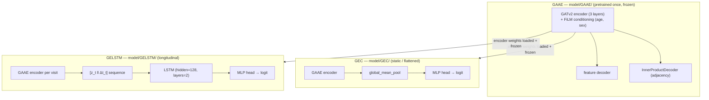
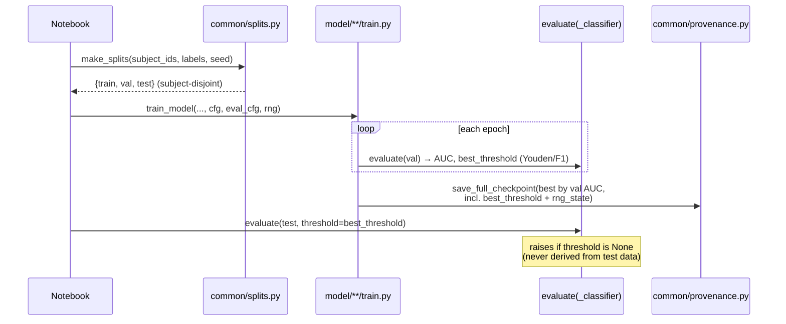
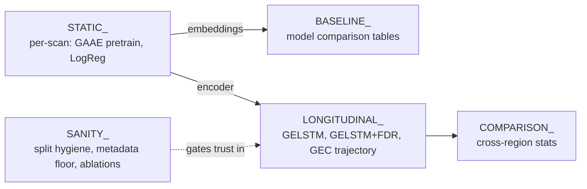

# CLASSIFIER Model Diagrams

Supplemental diagrams for [`../CODEBASE_KNOWLEDGE.md`](../CODEBASE_KNOWLEDGE.md).
Paths are relative to the repository root.

---

## 1. Model lineage: GAAE → GEC / GELSTM

Key files:
- `CLASSIFIER/model/GAAE/models.py`, `train.py`, `losses.py`
- `CLASSIFIER/model/GEC/models.py`, `train.py` (`train_classifier`, `evaluate_classifier`)
- `CLASSIFIER/model/GELSTM/models.py`, `train.py` (`train_model`, `evaluate`)
- Encoder transfer: `CLASSIFIER/common/utils.py::load_frozen_encoder_from_gaae`

---

## 2. Training + evaluation flow (leakage-safe threshold)

---

## 3. Experiment families (notebook prefixes)

