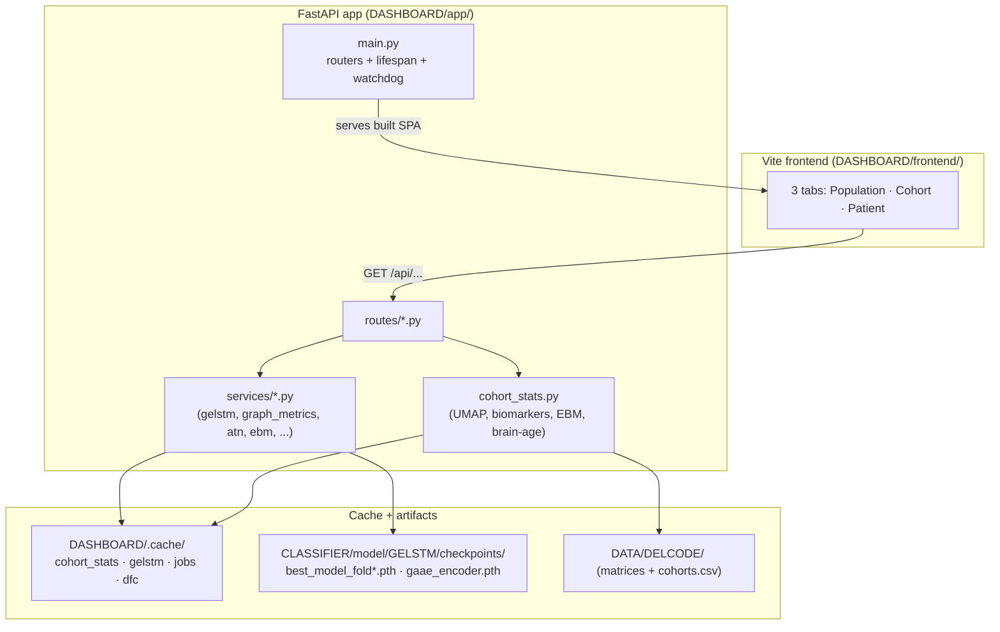
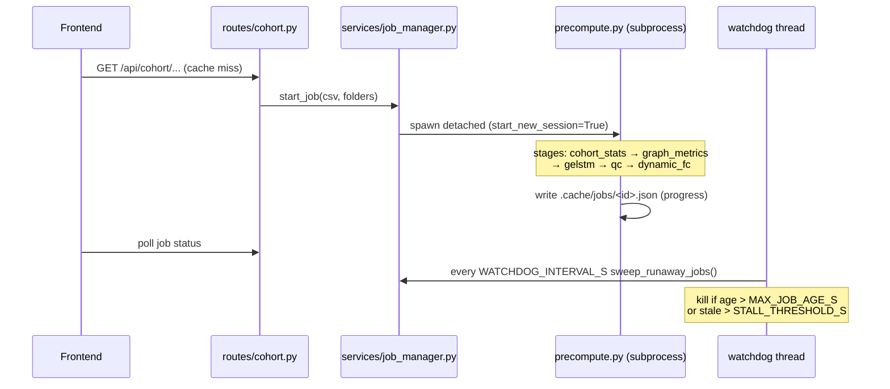

# DASHBOARD Architecture Diagrams

Supplemental diagrams for [`../CODEBASE_KNOWLEDGE.md`](../CODEBASE_KNOWLEDGE.md).
Paths are relative to the repository root.

---

## 1. Request/response topology



---

## 2. Detached precompute job lifecycle



---

## 3. GELSTM ensemble inference path

```mermaid
flowchart LR
    M["FC matrices per visit<br/>(.npz)"] --> SVC["services/gelstm.py"]
    GA["gaae_encoder.pth"] --> SVC
    F1["best_model_fold1..5.pth"] --> SVC
    SVC -->|model_version = SHA1(checkpoints)| CACHE["gelstm/predictions_*.pkl"]
    SVC -->|mean ± CI over folds| OUT["P(MCI→AD) per subject"]
    note["Reuses project-root .venv<br/>(torch / torch_geometric / nilearn)"]
    SVC -.-> note
```

> **Note:** The deep internals of the 5-stage precompute and the GELSTM service
> (exact function names, dFC k-means parameters) are documented from secondary
> reading; verify against `DASHBOARD/app/precompute.py` and
> `DASHBOARD/app/services/gelstm.py` before relying on specific signatures.
