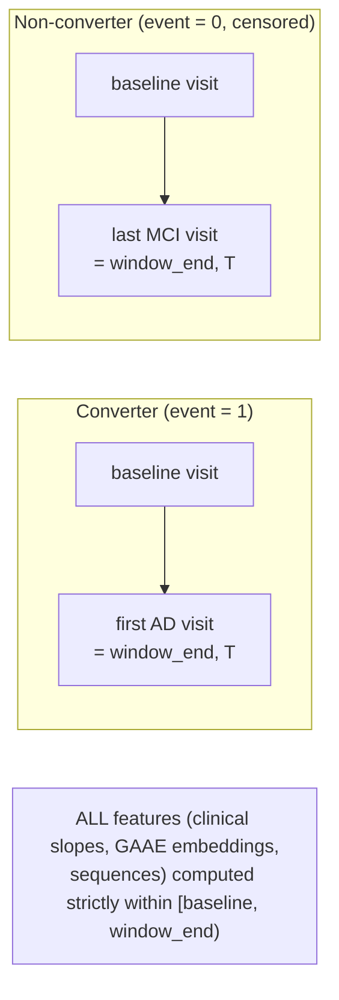
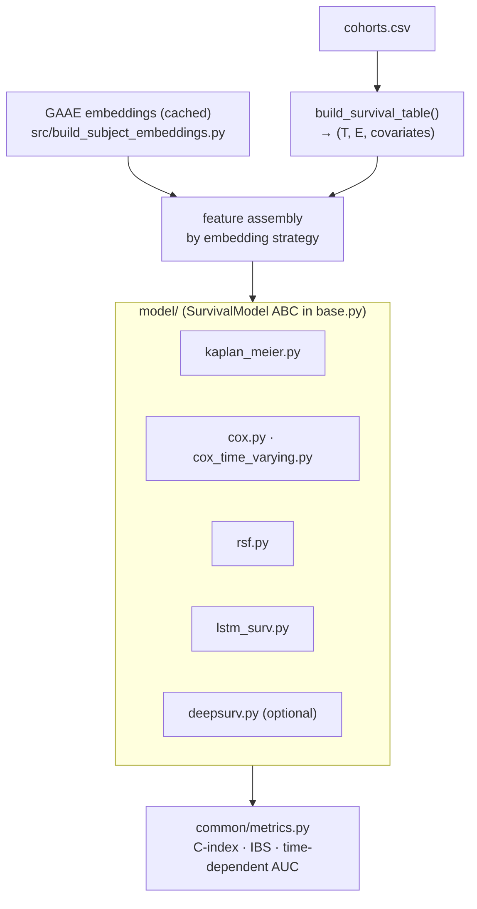
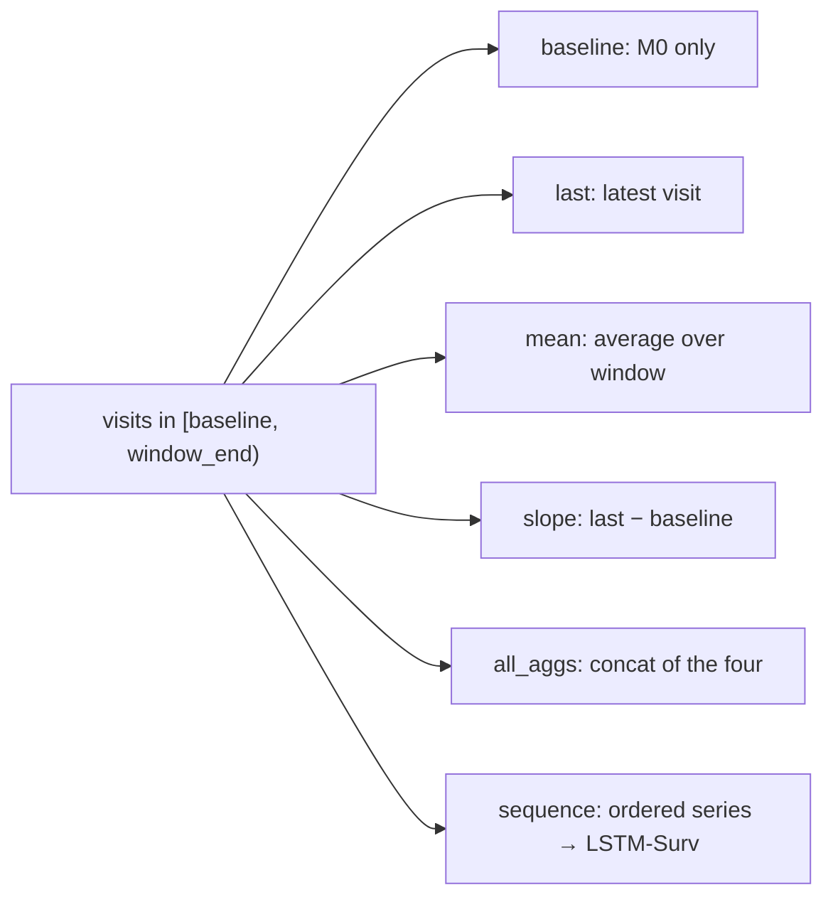

# PROGNOSER Survival Diagrams

Supplemental diagrams for [`../CODEBASE_KNOWLEDGE.md`](../CODEBASE_KNOWLEDGE.md).
Paths are relative to the repository root.

---

## 1. Symmetric at-risk window (no look-ahead)

Source: `PROGNOSER/common/survival_table.py` (module docstring).

---

## 2. Survival pipeline

---

## 3. Embedding strategies (which visits feed the model)

