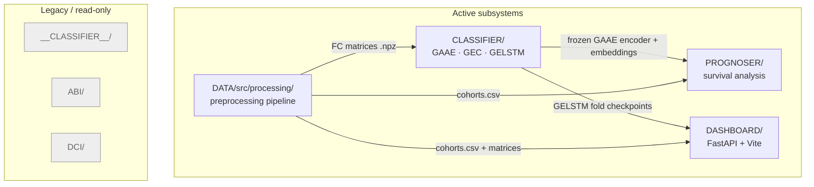
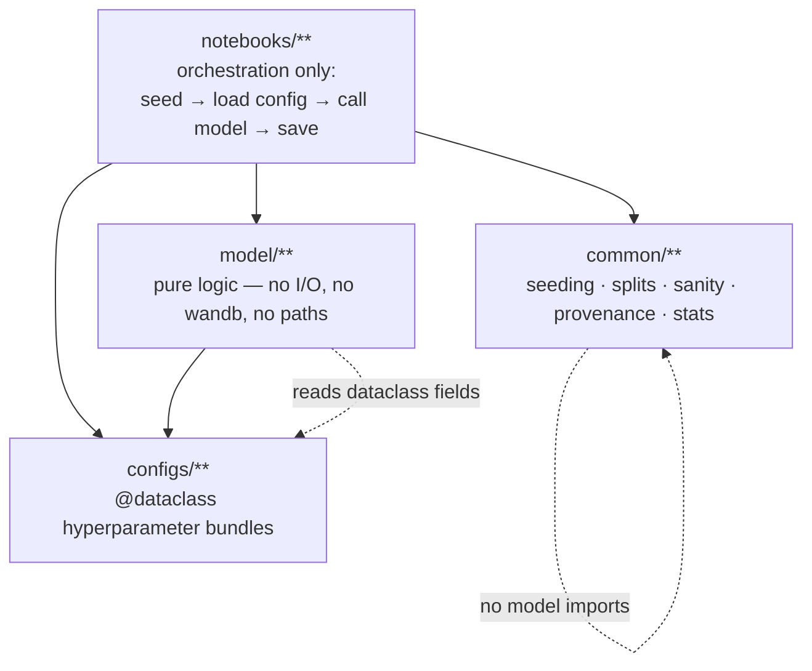

# System Architecture Diagrams

Supplemental diagrams for [`../CODEBASE_KNOWLEDGE.md`](../CODEBASE_KNOWLEDGE.md).
All paths are relative to the repository root.

---

## 1. Subsystem map (active vs legacy)



---

## 2. End-to-end data flow

```mermaid
flowchart LR
    A["Raw rs-fMRI BOLD<br/>DATA/DELCODE/__fmri...flat__/"]
        -->|atlas masking + Pearson + Fisher z| B["FC matrices<br/>DATA/DELCODE/__v3__..__v11__/matrices/*.npz"]
    B -->|ClassificationDataset → PyG graphs| C["GAAE encoder<br/>(pretrained, frozen)"]
    C -->|per-visit latent z (64-d)| D1["GEC<br/>static / flattened"]
    C -->|sequence of z + Δt| D2["GELSTM<br/>longitudinal"]
    C -->|embedding strategies| E["PROGNOSER<br/>Cox / RSF / LSTM-Surv / KM"]
    D2 -->|fold checkpoints| F["DASHBOARD<br/>ensemble inference + viz"]
    B --> F
    D1 -->|P(converter)| G["metrics + comparison<br/>DeLong · Holm · McNemar"]
    D2 -->|P(converter)| G
    E -->|C-index · IBS · td-AUC| G
```

---

## 3. Layered-architecture contract (enforced in `CLASSIFIER/`)


